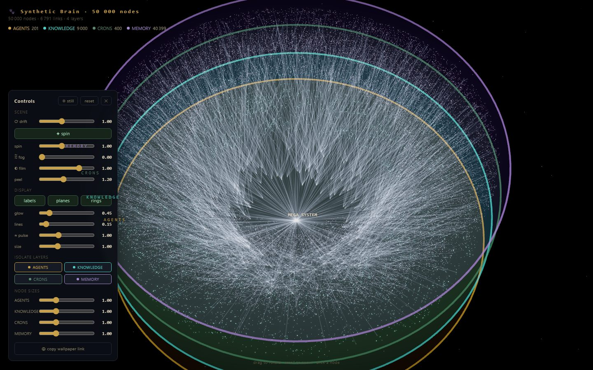

# 🐾 Booboo — the unified operational brain

> Turn any AI system's data into one living, rooted 3D brain — **structure + knowledge + memory + agents + automations** fused into a single graph. Query it by **REST or MCP**, view it in your **browser or as a desktop wallpaper**, and **boot your agents from it in one call**.

Named after a dachshund who never forgets where the treats are buried. Fitting, because Booboo is about exactly that: **memory and recall** — seeing the whole system at once, fetching what's buried, never losing the thread.


*Unretouched: `booboo view --demo --nodes 50000` — 50k nodes, 4 layers, live in a browser tab, zero console errors. Try it yourself in one command.*

Most tools show you *one* slice: a knowledge graph, an agent flow chart, a memory store, a trace viewer. Booboo fuses all of them into **one graph rooted at a single point**, so you can see — and query — how the whole system actually hangs together.

> **Status:** alpha — six packages, all published: [`@booboo-brain/spec`](https://www.npmjs.com/package/@booboo-brain/spec) (the contract), [`@booboo-brain/build`](https://www.npmjs.com/package/@booboo-brain/build) (config-driven postgres/json adapters), [`@booboo-brain/serve`](https://www.npmjs.com/package/@booboo-brain/serve) (REST + MCP query layer), [`@booboo-brain/viewer`](https://www.npmjs.com/package/@booboo-brain/viewer) (million-node 3D render), [`@booboo-brain/cli`](https://www.npmjs.com/package/@booboo-brain/cli) (the unified `booboo` command), and [`create-booboo`](https://www.npmjs.com/package/create-booboo) (project scaffolder). MIT.

---

## The one idea

Booboo is a tiny **JSON spec** at the center, with **adapters** that feed it and **consumers** that render/serve/query it:

```
  your data ──▶  ADAPTERS  ──▶  GRAPH JSON ──▶  CONSUMERS
  (postgres,     (config-       (the spec,       (3D viewer ·
   json, neo4j,   driven,        ~1 KB            REST API ·
   mcp, …)        ~50 lines)     contract)        MCP server · wallpaper)
```

Emit the JSON → get the viewer, the API, and the MCP server **for free**. Weird data → a ~50-line adapter, not a fork. See `SPEC.md`.

## Quickstart

```bash
npx create-booboo my-brain       # scaffold a project (json starter + postgres upgrade path)
cd my-brain
npm install
npm run build                    # booboo.config.yaml → brain.json (the snapshot)
npm run serve                    # REST API on http://localhost:8787
npm run mcp                      # MCP over stdio — point Claude / Cursor / Claude Code at it
```

Edit `booboo.config.yaml` to point at your own Postgres/Supabase (a commented example ships in the scaffold). Full reference: [docs/CONFIG.md](docs/CONFIG.md) · stuck? [docs/TROUBLESHOOTING.md](docs/TROUBLESHOOTING.md).

> The headline flex: **Booboo renders a million-node brain at 60fps in your browser.** Try it with `booboo view --demo --nodes 1000000` (or the viewer playground: `pnpm -F @booboo-brain/viewer dev`, then open with `?n=1000000`). See `SCALE.md` for how (instanced GPU field + tier-LOD).

> **Roadmap:** a single all-in-one command bundling build + REST + MCP + the 3D viewer together, an interactive scaffold wizard, and a `--demo` mega-graph generator — tracked in [LAUNCH_CHECKLIST.md](LAUNCH_CHECKLIST.md).

## What works today

```bash
booboo build --config booboo.config.yaml    # any postgres/json → one graph snapshot (privacy walls + parent spines)
booboo serve --snapshot my.booboo.json --port 8787   # REST: /graph /stats /search /nodes/:id /neighbors/:id /path/:a/:b
booboo mcp   --snapshot my.booboo.json               # MCP over stdio: booboo_stats/search/node/neighbors/path
booboo view  --snapshot my.booboo.json               # 3D viewer in your browser — no monorepo, no build step
```

`booboo view` serves the `@booboo-brain/viewer` 3D renderer as a standalone app — any snapshot (or `?n=1000000` synthetic) in your browser, no monorepo. The build engine was
proven on a real **4,469-node production brain** assembled straight from Supabase by config alone —
privacy-walled, validated, served. See each package's README for the details.

## Why it's different

The closest things on GitHub each do *one* layer — good tools, all of them, for their slice:

| | Whole-system view | REST API | MCP (agents query it) | 3D at 1M nodes | Privacy walls |
|---|:---:|:---:|:---:|:---:|:---:|
| **Booboo** | ✅ | ✅ | ✅ | ✅ | ✅ |
| Graph viewers (`3d-force-graph`) | render only | — | — | ✅ | — |
| Note graphs (Obsidian, Logseq) | your notes, not your system | — | plugins | — | — |
| Agent frameworks (LangGraph, traces) | flows & runs | ✅ | partial | — | — |
| Memory stores (Graphiti, Cognee) | memory only | ✅ | ✅ | — | — |

None fuse **wiring + knowledge + episodic memory + agents + crons** into one rooted, live, **bootable** brain that's simultaneously a view, a wallpaper, an API, and an MCP source. That operational fusion is the novel part.

## Key in hand (optional — everything above stays free)

Every feature is MIT and always will be. If you'd rather not do the setup yourself:

- **[The Booboo Drop — £29](https://fractionalhq.uk/#tiers)** · key in hand: a folder + operator prompt you paste into Claude Code or Cursor — your agent deploys your brain end-to-end while you answer five questions.
- **[Done-for-you](https://fractionalhq.uk/#tiers)** · we map *your* stack — custom adapters, hosted snapshot, refresh pipeline.

Both are built on this repo, same config schema — never a fork, never a gate.

## License

MIT — built to be forked, adapted, and shipped. By [Fractional HQ](https://fractionalhq.uk).
